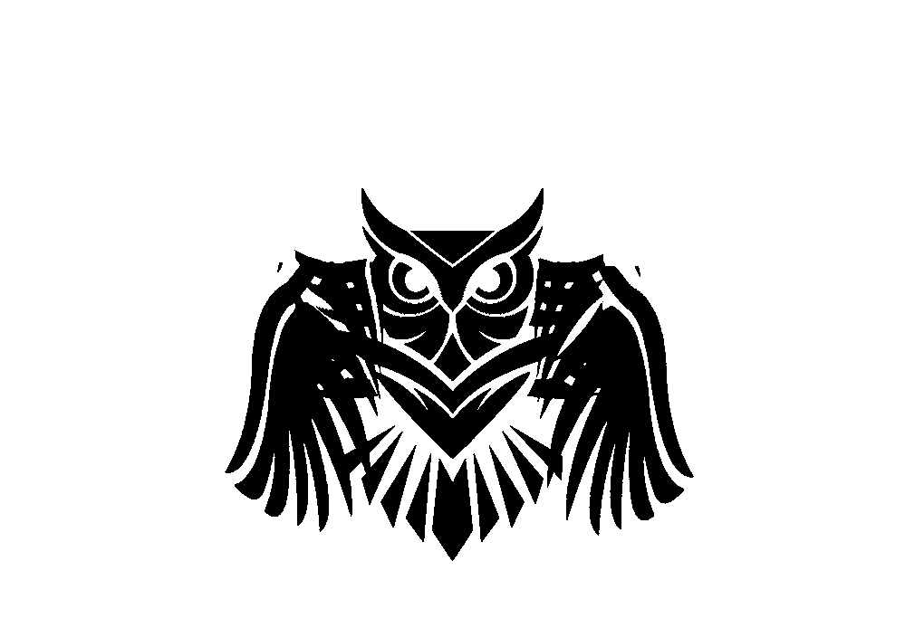

<h1 style="color: rgb(159,75,255);"> The Strigidae Estate </h1>

  <!--  -->  
    

  
  
  
  <pre>
    Sous les ifs noirs qui les abritent,
    Les hiboux se tiennent rangés,
    Ainsi que des dieux étrangers,
    Dardant leur oeil rouge ils méditent
    
    Sans remuer ils se tiendront 
    Jusqu'à l'heure mélancolique
    Où, poussant le soleil oblique,
    Les ténèbres s'établiront.

    Leur attitude au sage enseigne
    Qu'il faut en ce monde qu'il craigne
    Le tumulte et le mouvement ; 

    L'homme ivre d'une ombre qui passe
    Porte toujours le châtiment
    D'avoir voulu changer de place.
    </pre> 
  

 

  

 

  <a href="ttps://img.shields.io">
    <!-- -<WORD_ON_RIGHT>-informational?style=flat&logo=<LOGO_NAME>&logoColor=white&color=9745f5"/> --> 
     
    
    
    
    
    
    
    
    
    
    
    
    
    
    
    
    
    
    
    
    
    
    
    
    
</a>

<!--  -->

<!--  -->

<!--
**BasileNq/BasileNq** is a ✨ _special_ ✨ repository because its `README.md` (this file) appears on your GitHub profile.

Here are some ideas to get you started:

- 🔭 I’m currently working on ...
- 🌱 I’m currently learning ...
- 👯 I’m looking to collaborate on ...
- 🤔 I’m looking for help with ...
- 💬 Ask me about ...
- 📫 How to reach me: ...
- 😄 Pronouns: ...
- ⚡ Fun fact: ...
-->
